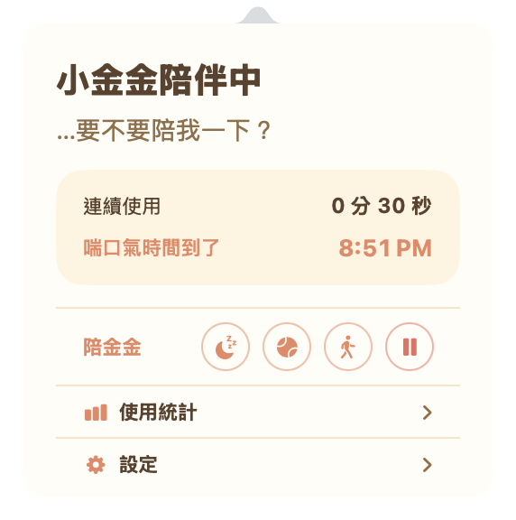
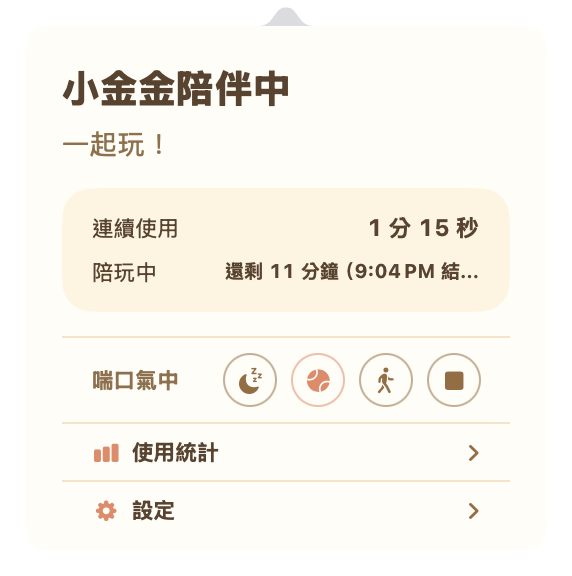
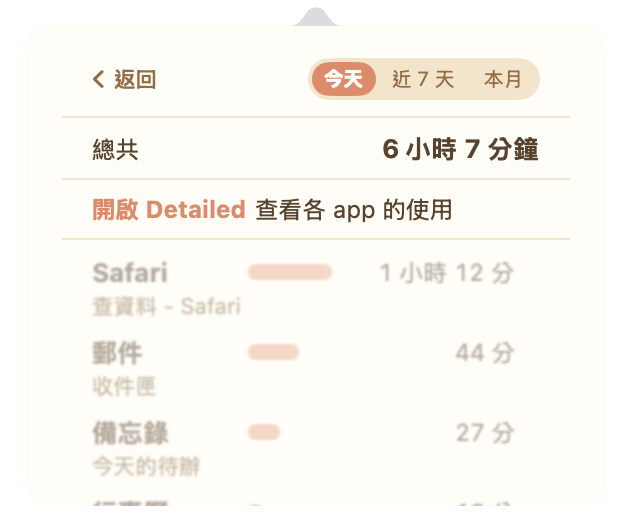

# goldenrave 小金金

住在 macOS 選單列的小金金，陪你工作，也提醒你休息。

- 網站：https://learnpytest.github.io/goldenrave/
- 下載最新版：https://github.com/learnpytest/goldenrave/releases/latest/download/goldenrave.dmg
- 所有版本：https://github.com/learnpytest/goldenrave/releases

免費 · macOS 14 Sonoma 以上

  
  
  

## 金金會做的事

- **時間到了，來邀請你**：工作到設定的時間，小金金會撲過來、說幾句話邀請你休息；一直沒理牠，牠會累到沒電，直到你休息或暫停提醒。
- **你可以陪金金**：休息、陪玩、散步三種方式，休息時小金金會浮到桌面上陪你。
- **看看今天用了多久**：今天、近 7 天、本月的使用時間。

**資料只存在你的 Mac 上**：不用帳號，也不會上傳任何使用紀錄。細節見 [隱私說明](docs/privacy.md)。

## 安裝

1. 下載 `goldenrave.dmg` 並打開。
2. 把 goldenrave 拖進「應用程式」。
3. 從「應用程式」打開，小金金就會出現在選單列。

之後有新版本時，設定頁會出現「更新到 x.y.z 版」。點下去會下載、驗證並自動取代 app，再重新打開；統計資料會保留。若更新檔無法自動下載，才會改顯示前往 GitHub 手動更新。

## 記錄模式

- **Private（預設）**：只記使用時間和休息紀錄，不需要任何系統權限。
- **Detailed**：另外記各 app 的使用時間。要在 macOS「系統設定 → 隱私權與安全性 → 輔助使用」允許 goldenrave；設定頁的「打開系統設定」會直接帶你到那一頁。

任何模式都不記錄按鍵、滑鼠位置、截圖或剪貼簿。連網只用來檢查 GitHub 上有沒有新版本；你按下更新後，才會再下載 GitHub Release 的 app，完全不會送出使用資料。

---

## 開發

完整的 Xcode 才能在本機編譯（SwiftData 的 macro 需要）；平常都交給 GitHub Actions：

- `macOS checks`（`ci.yml`）：每次 push 都會跑測試、打包，產生可下載的 `goldenrave-macOS-dmg`。
- `Release`（`release.yml`）：推 `v*` tag 時，檢查 tag 與 `Packaging/Info.plist` 的版號一致、跑完測試，建立 GitHub Release 並附上 `goldenrave.dmg`，再重新發佈網站。
- `Pages`（`pages.yml`）：`site/` 有變動時發佈網站，並自動填入最新版號與網頁最後更新日期。

### 發佈新版本

1. 把 `Packaging/Info.plist` 的 `CFBundleShortVersionString` 改成新版號，合併進 `main`。
2. 在 `main` 打 tag 並推上去：`git tag v1.0.6 && git push origin v1.0.6`。

### 網站與 README

網站（`site/index.html`）和這份 README 說的是同一件事，改其中一邊時，另一邊要一起改。
